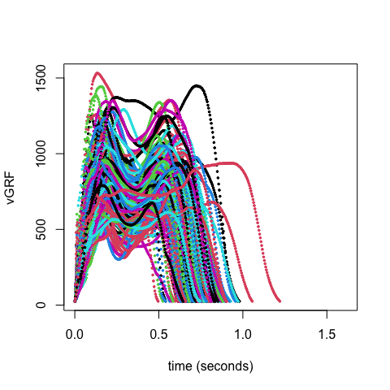
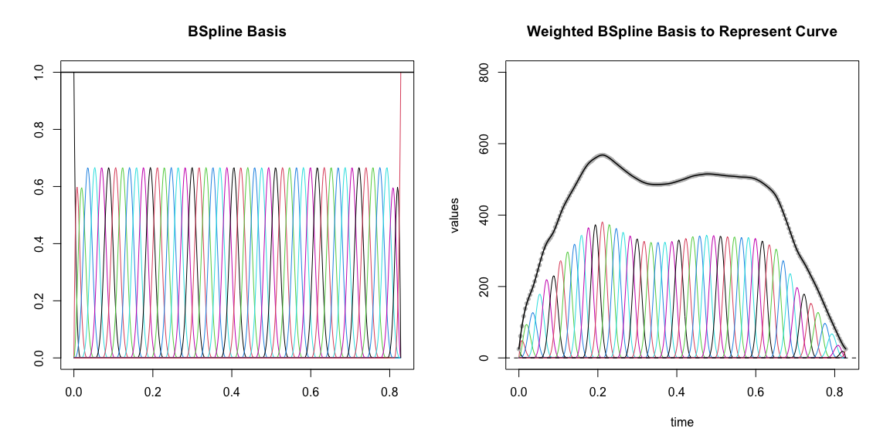
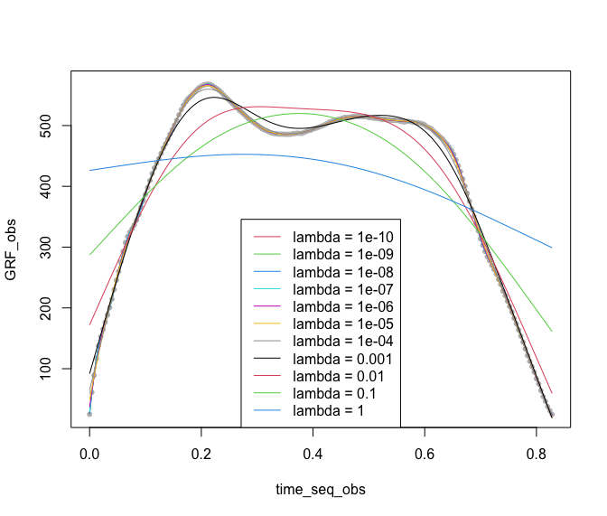
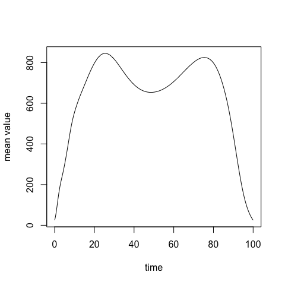

<u>ISBS Online Symposium</u>: Preparing Biomechanical Time Series’ for
Functional Data Analysis
================

- [Introduction](#introduction)
- [🖥 Computing Pre-requisites](#-computing-pre-requisites)
  - [R and RStudio](#r-and-rstudio)
- [⏱️ Schedule](#️-schedule)
- [🎒 Main Tutorial](#-main-tutorial)
  - [Reading Time-Series Data](#reading-time-series-data)
  - [Read in the csv file:](#read-in-the-csv-file)
  - [Inspecting the loaded data](#inspecting-the-loaded-data)
  - [Data Preprocessing and
    Preparation](#data-preprocessing-and-preparation)
    - [Issue 1: Smoothing](#issue-1-smoothing)
    - [Issue 2: Time Normalization](#issue-2-time-normalization)
  - [Data Export](#data-export)
  - [Summarizing the Data (basics)](#summarizing-the-data-basics)
  - [Conclusion (and some personal
    perspectives)](#conclusion-and-some-personal-perspectives)
  - [📖 Further Reading](#-further-reading)
  - [Session Info for
    Reproducibility](#session-info-for-reproducibility)

<div style="text-align: center;">


</div>

## Introduction

Welcome to this workshop on Functional Data Analysis (FDA) for Sports
Biomechanics, as part of the ISBS Online Symposium. This document serves
as a guide for working with time-series data and preparing it for
functional data analysis in R.

- This tutorial <u>**does**</u> cover, basic data import, formatting,
  preparation and inspecting techniques. It will teach you how to go
  from raw biomechanical time series’ to functional data that are ready
  to be analysed.

- This tutorial <u>**does not**</u> cover more advanced analytical
  techniques from FDA – we have [a
  book](https://link.springer.com/book/10.1007/978-3-031-68862-1) and
  [material from a full one-day
  course](https://github.com/edwardgunning/ISBS-Short-Course) for this.

- We encourage participants to ask questions and discuss how the
  material relates to their own work, either during the presentation by
  using the “raise hand” function ion zoom, in the chat, or during the
  dedicated question time at the end.

- The material will remain **live and publicly available** after the
  workshop, in the hope that you will use it as part of your own data
  analysis and research.

- You can contact me at <Edward.Gunning@pennmedicine.upenn.edu> if you
  spot any typos that should be fixed, or have any questions about the
  material.

## 🖥 Computing Pre-requisites

### R and RStudio

If you want to follow along and program yourself, either retrospectively
or in real time, you should have the following software installed:

- **The R Language for Statistical Computing**
  - It can be downloaded from <https://cloud.r-project.org>
  - For further assistance see [this video by RStudio
    education](https://vimeo.com/203516510)
- **The RStudio Integrated Development Environment (IDE)**
  - It can be downloaded from <https://posit.co/>
  - For further assistance see [this video by RStudio
    education](https://vimeo.com/203516510) (**Note**: The RStudio
    company has changed to Posit PBC, so there may be some minor
    differences)

**Note**: If you are unable to install R and RStudio, you can work with
a free, lite web version of RStudio called [*posit
cloud*](https://posit.cloud/). Watch [this video from Posit
PBC](https://www.youtube.com/watch?v=-fzwm4ZhVQQ) to set up an account
and get started.

We also recommend setting up an RStudio project to work and store your
files for this workshop in – see [this helpful guide on setting up
projects by Posit
PBC](https://support.posit.co/hc/en-us/articles/200526207-Using-RStudio-Projects).

**IMPORTANT**: **We do not require any previous knowledge of R
programming or FDA**. We have structured the lecture and practical
sessions in such a way that all levels of experience will be catered
for. However, if interested, our favourite (free!) resources for getting
up to speed with R are:

- [R for Data Science (2nd Edition)](https://r4ds.hadley.nz/) by Hadley
  Wickham, Mine Çetinkaya-Rundel, and Garrett Grolemund.

- [R Programming for Data
  Science](https://bookdown.org/rdpeng/rprogdatascience/) by Roger D.
  Peng.

# ⏱️ Schedule

These times are in British Standard Time (BST):

|              Time | Topic                                |    Lead     |
|------------------:|:-------------------------------------|:-----------:|
| $12.00$ - $12.25$ | Welcome, Introduction and Background |     DH      |
| $12.25$ - $13.30$ | Practical Tutorial                   |     EG      |
| $13.30$ - $14.00$ | Q&A and Discussion                   | DH, EG & JW |

------------------------------------------------------------------------

# 🎒 Main Tutorial

### Reading Time-Series Data

<details>
<summary>
🖱️ Click to Expand 🖱
</summary>

In this workshop, we will use the GaitRec dataset, specifically the
right leg vertical ground reaction force (vGRF) data. The data are
stored in a comma separated value (CSV) file on the [GaitRec Figshare
link](https://figshare.com/articles/dataset/GRF_F_V_RAW_right/11394825?backTo=%2Fcollections%2FGaitRec_A_large-scale_ground_reaction_force_dataset_of_healthy_and_impaired_gait%2F4788012&file=22063200)
and can be downloaded directly
[here](https://figshare.com/ndownloader/files/22063200). Each time
series is stored as a row of the CSV file, with associated metadata
including subject ID, session number, and trial ID. Since trials have
different durations, some rows contain missing values (`NA`s) where the
recorded data length varies. Our goal is to preprocess these data,
preparing them for functional data analysis.

### Read in the csv file:

There are many options to read in text files in R (e.g., comma or tab
separated values files). Here, we’ll use base R `read.csv()` function.
Since we are working within a project, we just have to point to the
*relative path* to the file.

``` r
GRF_data <- read.csv(file = "data/GRF_F_V_RAW_right.csv")
```

------------------------------------------------------------------------

***Aside:***

There exist faster functions in specialized packages for reading in
large csv files. Let’s time trial `read.csv()` with `read_csv()` from
the `readr` package and `fread` from the `data.table` package. From just
one run it seems `fread()` is marginally faster than `read_csv()`, but
both are orders of magnitude faster than `read.csv()`.

``` r
runtime_1 <- system.time(GRF_data_1 <- read.csv(file = "data/GRF_F_V_RAW_right.csv"))
runtime_2 <- system.time(GRF_data_2 <- readr::read_csv(file = "data/GRF_F_V_RAW_right.csv", 
                                                    col_types = c(rep("i", 3), rep("n", 405))))
```

    ## Warning: One or more parsing issues, call `problems()` on your data frame for details,
    ## e.g.:
    ##   dat <- vroom(...)
    ##   problems(dat)

``` r
runtime_3 <- system.time(GRF_data_3 <- data.table::fread(file = "data/GRF_F_V_RAW_right.csv"))

# Examine the results:
print(paste0("read.csv = ", round(runtime_1["elapsed"], 2), " seconds; read_csv = ",
             round(runtime_2["elapsed"], 2), " seconds; fread = ",
             round(runtime_3["elapsed"], 2), " seconds"))
```

    ## [1] "read.csv = 18.89 seconds; read_csv = 1.01 seconds; fread = 0.55 seconds"

``` r
rm(list = paste0("GRF_data_", 1:3)) # remove the created data objects from our environments
```

- We should actually do this comparison by running the code for multiple
  repetitions using `microbenchmark()` from the `microbenchmark`
  package.

</details>

------------------------------------------------------------------------

### Inspecting the loaded data

<details>
<summary>
🖱️ Click to Expand 🖱
</summary>

The data is read in as a data frame, which is useful for storing tabular
data where the columns are heterogenous in nature (e.g., contains some
numeric and some factors or strings).

``` r
class(GRF_data)
```

    ## [1] "data.frame"

This dataset contains over $75,000$ rows. This meaans its a fantastic
resource for statistics and machine learning applications. However, for
the purpose of this tutorial, we’ll take a random sample of $200$ rows
to make it more manageable.

``` r
dim(GRF_data) # check dimensions
```

    ## [1] 75732   408

``` r
set.seed(1)
sample_inds <- sample(seq_len(length.out = nrow(GRF_data)), size = 200)
GRF_data <- GRF_data[sample_inds, ]
dim(GRF_data) # check dimensions again
```

    ## [1] 200 408

We can also split the data out into the first three columns (subject,
session and trial IDs) and the remaining $405$ columns which include the
sampled time series. Since the remaining $405$ columns are all numeric
containing time series values, it is appropriate to store them as a
matrix.

``` r
meta_df <- GRF_data[, 1:3] # first three columns
GRF_matrix <- as.matrix(GRF_data[, - c(1:3)])  # remaining columns
```

We can also create a $405$-dimensional vector representing the time
argument. Since these data are sampled at $250$ Hz, we have that each
time difference is $1/250$.

``` r
frames_per_second <- 250
seconds_per_frame <- 1 / frames_per_second
time_seq <- seq(0, seconds_per_frame * (405 - 1), by = seconds_per_frame)
```

We can use the `matplot()` function to plot the columns of a matrix, so
we need to transpose (rotate) `GRF_matrix` when passing it as an
argument using the `t()` function.

``` r
matplot(x = time_seq,
        y = t(GRF_matrix), 
        type = "b", 
        cex = 0.5, 
        pch = 20, 
        ylab = "vGRF",
        xlab = "time (seconds)")
```

<!-- -->

</details>

## Data Preprocessing and Preparation

<details>
<summary>
🖱️ Click to Expand 🖱
</summary>

In this section, we’ll discuss a number of important issues in data
preparation.

For this, we’ll use the `fda` package so we need to load it.

``` r
library(fda)
```

</details>

### Issue 1: Smoothing

<details>
<summary>
🖱️ Click to Expand 🖱
</summary>

- The first issue is representing each sampled time series as a *smooth*
  function (or curve).

- In the`fda` package, this representation is done using a **basis
  function representation**.

- In short, we use a linear combination (or weighted sum) of some set of
  basis functions that *we know*, to approximate each individual curve.
  Then, under the hood, the data are stored as the combination of the
  basis (i.e., the known functions) and vector of basis coefficients for
  an individual curve (i.e., the weights).

- We can choose the basis coefficients based on whether we want to
  **smooth** or interpolate the raw data.

#### Demonstration: Representing a single curve

We’ll extract the first row of the dataset. We only take the non `NA`
values, and take the correponding values for the time argument.

``` r
GRF_obs_full <- GRF_matrix[1,]
GRF_obs <- GRF_obs_full[!is.na(GRF_obs_full)]
time_seq_obs <- time_seq[seq_len(length(GRF_obs))]
```

``` r
Bspline_basis_k50 <- create.bspline.basis(rangeval = range(time_seq_obs),
                                           nbasis = 50)

GRF_obs_1_fdSmooth <- smooth.basis(argvals = time_seq_obs,
                                   y = GRF_obs, 
                                   fdParobj = Bspline_basis_k50)

par(mfrow = c(1, 2))
plot(Bspline_basis_k50, knots = FALSE, lty = 1)
abline(h = 1, lwd = 1.5)
title("BSpline Basis")
plot.fd(fd(coef = diag(GRF_obs_1_fdSmooth$fd$coefs[,1]),
                  Bspline_basis_k50), lty = 1, ylim = c(0, 800))
```

    ## [1] "done"

``` r
points(x = time_seq_obs, GRF_obs, pch = 20, col = "grey")
lines.fdSmooth(GRF_obs_1_fdSmooth, col = "black", lwd = 1.5)
title("Weighted BSpline Basis to Represent Curve")
```

<!-- -->

**What is happening under the hood?**

$\rightarrow$ We have gone from a vector of discrete values to a
representation of the functional data in terms of a vector of basis
coefficients and a set of basis functions.

These are stored as an `fd` object:

``` r
GRF_obs_1_fd <- GRF_obs_1_fdSmooth$fd
GRF_obs_1_fd[["coefs"]]
```

    ##               [,1]
    ## bspl4.1   25.00460
    ## bspl4.2   81.25938
    ## bspl4.3  157.04986
    ## bspl4.4  190.07329
    ## bspl4.5  268.12894
    ## bspl4.6  329.15378
    ## bspl4.7  345.72885
    ## bspl4.8  408.46480
    ## bspl4.9  445.78514
    ## bspl4.10 478.51430
    ## bspl4.11 515.62800
    ## bspl4.12 547.61700
    ## bspl4.13 559.95332
    ## bspl4.14 572.20640
    ## bspl4.15 560.70010
    ## bspl4.16 544.25105
    ## bspl4.17 528.38058
    ## bspl4.18 513.01708
    ## bspl4.19 500.69776
    ## bspl4.20 489.92060
    ## bspl4.21 485.53001
    ## bspl4.22 485.60998
    ## bspl4.23 486.27718
    ## bspl4.24 489.26226
    ## bspl4.25 495.78546
    ## bspl4.26 501.91378
    ## bspl4.27 510.02323
    ## bspl4.28 512.83426
    ## bspl4.29 515.98829
    ## bspl4.30 514.43069
    ## bspl4.31 512.15193
    ## bspl4.32 509.51522
    ## bspl4.33 508.64815
    ## bspl4.34 506.10205
    ## bspl4.35 506.20724
    ## bspl4.36 502.36358
    ## bspl4.37 491.31281
    ## bspl4.38 475.65484
    ## bspl4.39 457.41984
    ## bspl4.40 408.82668
    ## bspl4.41 354.67596
    ## bspl4.42 296.03275
    ## bspl4.43 268.22747
    ## bspl4.44 229.15697
    ## bspl4.45 190.79554
    ## bspl4.46 144.96536
    ## bspl4.47 100.93424
    ## bspl4.48  58.91644
    ## bspl4.49  31.49572
    ## bspl4.50  25.17126

``` r
GRF_obs_1_fd[["basis"]]
```

    ## $call
    ## basisfd(type = type, rangeval = rangeval, nbasis = nbasis, params = params, 
    ##     dropind = dropind, quadvals = quadvals, values = values, 
    ##     basisvalues = basisvalues)
    ## 
    ## $type
    ## [1] "bspline"
    ## 
    ## $rangeval
    ## [1] 0.000 0.828
    ## 
    ## $nbasis
    ## [1] 50
    ## 
    ## $params
    ##  [1] 0.01761702 0.03523404 0.05285106 0.07046809 0.08808511 0.10570213
    ##  [7] 0.12331915 0.14093617 0.15855319 0.17617021 0.19378723 0.21140426
    ## [13] 0.22902128 0.24663830 0.26425532 0.28187234 0.29948936 0.31710638
    ## [19] 0.33472340 0.35234043 0.36995745 0.38757447 0.40519149 0.42280851
    ## [25] 0.44042553 0.45804255 0.47565957 0.49327660 0.51089362 0.52851064
    ## [31] 0.54612766 0.56374468 0.58136170 0.59897872 0.61659574 0.63421277
    ## [37] 0.65182979 0.66944681 0.68706383 0.70468085 0.72229787 0.73991489
    ## [43] 0.75753191 0.77514894 0.79276596 0.81038298
    ## 
    ## $dropind
    ## NULL
    ## 
    ## $quadvals
    ## NULL
    ## 
    ## $values
    ## list()
    ## 
    ## $basisvalues
    ## list()
    ## 
    ## $names
    ##  [1] "bspl4.1"  "bspl4.2"  "bspl4.3"  "bspl4.4"  "bspl4.5"  "bspl4.6" 
    ##  [7] "bspl4.7"  "bspl4.8"  "bspl4.9"  "bspl4.10" "bspl4.11" "bspl4.12"
    ## [13] "bspl4.13" "bspl4.14" "bspl4.15" "bspl4.16" "bspl4.17" "bspl4.18"
    ## [19] "bspl4.19" "bspl4.20" "bspl4.21" "bspl4.22" "bspl4.23" "bspl4.24"
    ## [25] "bspl4.25" "bspl4.26" "bspl4.27" "bspl4.28" "bspl4.29" "bspl4.30"
    ## [31] "bspl4.31" "bspl4.32" "bspl4.33" "bspl4.34" "bspl4.35" "bspl4.36"
    ## [37] "bspl4.37" "bspl4.38" "bspl4.39" "bspl4.40" "bspl4.41" "bspl4.42"
    ## [43] "bspl4.43" "bspl4.44" "bspl4.45" "bspl4.46" "bspl4.47" "bspl4.48"
    ## [49] "bspl4.49" "bspl4.50"
    ## 
    ## attr(,"class")
    ## [1] "basisfd"

This means that we are not bound by the dicrete points at which the data
are measured, we can evaluate the curve at **any** point in the domain,
by simply evluating the basis functions at these points.

The first issue that needs to be considered – **do we need to smooth or
interpolate the data**?

- If they have been filtered already, e.g., using a Butterworth filter
  applied to marker trajectories, we probably don’t need to re-smooth
  them. Therefore we choose a large number of basis functions `nbasis`
  and do not apply a smoothing penalty.

- If we have the raw signal and need to remove noise/ errors, we should
  use the FDA tools to smooth the data. We can either do this by
  choosing a smaller number of basis functions, or preferably, add a
  smoothness penalty controlled by a weight parameter $\lambda$ in the
  objective function when computing the coefficients.

``` r
lambda_seq <- 10^seq(-10, 0, by = 1)

plot(x = time_seq_obs, GRF_obs, pch = 20, col = "grey")
for(lami in seq_along(lambda_seq)) {
  fdsmooth_i <- smooth.basis(argvals = time_seq_obs,
                             y = GRF_obs, 
                             fdParobj = fdPar(fdobj = Bspline_basis_k50,
                                              Lfdobj = 2,
                                              lambda = lambda_seq[lami]))
  lines.fdSmooth(fdsmooth_i, col = lami + 1)
}
legend("bottom", paste0("lambda = ", lambda_seq), 
       col = seq_along(lambda_seq) + 1, 
       lty = 1)
```

<!-- -->

- We can see that varying $\lambda$ gives different fits, we should
  choose the optimal value by cross-validation or generalized
  cross-validation (see Chapter 2 of book).

- Refer to the book Chapter 2 for details on different types of bases
  and other considerations when smoothing (e.g., suitable
  representations of derivatives/ rates of change).

</details>

### Issue 2: Time Normalization

<details>
<summary>
🖱️ Click to Expand 🖱
</summary>

- We have fitted to a single curve, and we have used the observed time
  values to define its domain.

- However, standard functional data analysis software (i.e., the `fda`
  package) requires the functional data to be represented on a common
  domain (**Note:** There are some exceptions such as the work of Gellar
  et al. (2014) and Sangalli et al. (2010) do not require a common
  domain/ equal length curves).

- These data – and many biomechanical time series – are of different
  lengths because people take different amounts of time to complete a
  movement.

- Therefore we need to consider methods to standardize/ normalize the
  domains of each observation to use them with the `fda` package.

- The most common approach, particularly for periodic data or data with
  very clearly defined start and end points, is to linearly time (or
  length) normalise. That is, we linearly stretch or compress the time
  values so that the start and end of each curve match, and we can treat
  them as data defined on a common domain.

#### 2 (a) <u>Common Approach</u>: Resample to Time Normalize and then Smooth

- Use a cubic spline to interpolate the data to $101$ points (often done
  in motion capture software), Do this to each row of the data.

- We use `apply()` to do the same operation to each row of the data – we
  could also do it in a loop.

- This gives us a $200 \times 101$ matrix that we can pass to
  `smooth.basis()` to smooth/ represent all the curves collectively.

``` r
GRF_matrix_normalized <- apply(X = GRF_matrix, MARGIN = 1, 
                               FUN = function(x) {
                                 obs <- x[!is.na(x)]
                                 time_seq_obs <- time_seq[seq_len(length(obs))]
                                  spline(x = time_seq_obs, y = obs, n = 101)$y
                               })
GRF_matrix_normalized <- t(GRF_matrix_normalized)
time_seq_normalized <- 0:100
matplot(x = time_seq_normalized,
        y = t(GRF_matrix_normalized), 
        type = "b", 
        cex = 0.5, 
        pch = 20, 
        ylab = "vGRF",
        xlab = "time (seconds)")
```

<!-- -->

- We can pass the $101\times200$ matrix (after transposing) to
  `smooth.basis()` and it will do the smoothig/ representation of all
  the curves collectively.

``` r
Bspline_basis_k50_normalized <- create.bspline.basis(rangeval = c(0, 100), 
                                                     nbasis = 50)
GRF_fdSmooth <- smooth.basis(argvals = time_seq_normalized,
                             y = t(GRF_matrix_normalized), 
                             fdParobj = Bspline_basis_k50_normalized)
GRF_fd <- GRF_fdSmooth$fd 
plot(GRF_fd)
```

<!-- -->

    ## [1] "done"

#### 2 (b) <u>More Principled Approach</u>: Do Smoothing and Time Normalization Together

- When we use cubic spline interpolation, we actually just interpolate
  onto a B-spline basis and evaluate at $101$ points.

- We can actually do all of this using the `fda` package, and this might
  be preferable for a few reasons:

  1.  We avoid an intermediate resampling step, which may distort/ lose
      information (though maybe not if the data are smooth enough and
      the grid of time points is fine enough)
  2.  If the data *are* noisy, we don’t really want to interpolate noise
      and smooth the result, we would prefer to smooth the resulting
      data.

Below is code that uses a very simple for loop to for each curve
individually to a basis on the same domain and store the resulting `fd`
object:

**Note:** We are using the same basis, but using different evaluation
points to fit each curve, storing the coefficients and combining them to
create the fd object.

``` r
coef_matrix <- matrix(NA, nrow = 200, ncol = Bspline_basis_k50_normalized$nbasis)
for(i in 1:200) {
  obs_i <- GRF_matrix[i, ]
  obs_i <- obs_i[!is.na(obs_i)]
  time_seq_obs_i <- time_seq[seq_len(length(obs_i))]
  time_seq_obs_i_normalized <- (time_seq_obs_i / max(time_seq_obs_i)) * 100
  fdsmooth_i <- smooth.basis(argvals = time_seq_obs_i_normalized,
                             y = obs_i, 
                             fdParobj = Bspline_basis_k50_normalized)
  coef_matrix[i, ] <- fdsmooth_i$fd$coefs
}

# create fd object
GRF_fd_2 <- fd(coef = t(coef_matrix), basisobj = Bspline_basis_k50_normalized)

par(mfrow = c(1, 2))
plot(GRF_fd)
```

    ## [1] "done"

``` r
title("Approach 1")
plot(GRF_fd_2)
```

    ## [1] "done"

``` r
title("Approach 2")
```

<!-- -->

- [Link to flowchart from my
  thesis](https://github.com/edwardgunning/thesis-chapt-3/blob/main/outputs/basis-expansion-diagram/2023-01-02-basis-expansion-diagram.pdf).

#### <u>Other approaches and further thoughts</u>

- If you time normalise, you should carry through curve length as an
  additional parameter. Don’t just discard it!

- There are some other approaches people have considered. They don’t
  make sense in this context (I think), but I’m demonstrating them just
  to show that *how you define your domain* matters.

- In some instances, possibly where the data are not periodic/
  repeating, it may make more sense to pad the data with the final value
  (sometimes zero for forces data).

``` r
GRF_matrix_zero_padded <- GRF_matrix
GRF_matrix_zero_padded[is.na(GRF_matrix_zero_padded)] <- 0
```

- Or, you might choose a physical time domain (un-normalized) over which
  all the curves are defined.

``` r
min_time <- min(apply(GRF_matrix, 1, function(x) sum(is.na(x))))
time_seq_min <- time_seq[seq_len(min_time)]
GRF_matrix_min <- GRF_matrix[, seq_len(min_time)]
```

- Let’s have a look at all three approaches and the original data
  side-by-side.

``` r
par(mfrow = c(2, 2))
matplot(time_seq, t(GRF_matrix),  
        type = "b", 
        cex = 0.5, 
        pch = 20)
title("Raw Data")
matplot(time_seq_normalized, t(GRF_matrix_normalized),
        type = "b", 
        cex = 0.5, 
        pch = 20)
title("Time Normalised")
matplot(time_seq, t(GRF_matrix_zero_padded),  
        type = "b", 
        cex = 0.5, 
        pch = 20)
title("Zero-Padded")
matplot(time_seq_min, 
        t(GRF_matrix_min),  
        type = "b", 
        cex = 0.5, 
        pch = 20)
title("Chopped")
```

<!-- -->

</details>

## Data Export

<details>
<summary>
🖱️ Click to Expand 🖱
</summary>

- We typically want to save iterations of our data at multiple stages in
  the workflow, and will rarely complete an analysis in a single
  interactive session.

- Therefore, we need to be able to save and import the objects that we
  create.

- The canonical way to store R objects, such as the `fd` object we have
  created, is in “R’s custom binary format called RDS” (Wickham and
  Grolemund, 2017).

- The functions to save and read RDS objects are straightforward:

``` r
# save 
saveRDS(object = GRF_fd, file = "saved-objects/GRF_fd.rds")
# and read back in
GRF_fd <- readRDS(file = "saved-objects/GRF_fd.rds")
```

- We could also consider svaing just the basis as an `RDS` object and
  the coefficients in a more familiar CSV or TSV format (e.g., using
  `write.csv()`).

</details>

## Summarizing the Data (basics)

<details>
<summary>
🖱️ Click to Expand 🖱
</summary>

Once we have represented our data as an `fd` object, we can apply
visualisation, summary and analysis functions from the `fda` package.
Here are a number of simple visualisation functions that act directly on
the `fd` object.

1.  **`plot.fd()`** Plot the full functional data object.

``` r
plot.fd(GRF_fd)
```

<!-- -->

    ## [1] "done"

2.  **`mean.fd()`** Calculate the sample mean of a functional data
    object (we’ll then plot it).

``` r
GRF_mean_fd <- mean.fd(GRF_fd)
plot.fd(GRF_mean_fd)
```

<!-- -->

    ## [1] "done"

3.  **`boxplot.fd`** Display the functional version of the boxplot Sun
    and Genton (2011) of the `fd` object (see and Chapter 3 of our book
    for a summary of how to interpret it).

``` r
boxplot.fd(GRF_fd)
```

<!-- -->

    ## $depth
    ##      24388      59521      43307      69586      11571      25173      32618 
    ## 0.15424698 0.26345440 0.33331758 0.46377979 0.34661376 0.44808448 0.39881337 
    ##      13903       8229      25305      22306      12204      43809      72611 
    ## 0.29897756 0.31075427 0.48088313 0.21714762 0.46012886 0.42941788 0.35905717 
    ##      36244      45399       6519      19242      21875      58472      62956 
    ## 0.33910891 0.22263048 0.31263894 0.42356286 0.39725807 0.07458928 0.45718643 
    ##      21323      13284       7976       9392       3863      52253      26876 
    ## 0.24355391 0.38198468 0.44594010 0.40918802 0.17753769 0.23827305 0.34427136 
    ##      13973      31334      39241      47959      28278      66394      72299 
    ## 0.31405692 0.38260461 0.05842430 0.27383004 0.07021792 0.19313747 0.38264541 
    ##      11367      13602       5051      16920      29660      56659      29697 
    ## 0.41519528 0.29992985 0.36777203 0.27908602 0.31182397 0.41927011 0.39514652 
    ##      11854      70470      58661      51118      27075      22126      55091 
    ## 0.40876511 0.41499328 0.35293447 0.33232748 0.28841783 0.38808647 0.45828996 
    ##      58684      32987      12399      25488      60772      55084      51305 
    ## 0.35794268 0.43949400 0.33669685 0.37020499 0.29764615 0.42593313 0.32780686 
    ##      17626       8465       6563      62126      20205      62480      68581 
    ## 0.18992636 0.38685258 0.34503856 0.35500522 0.44865963 0.34105528 0.30990248 
    ##      55968       8615      41381      45196       9346      13824       8696 
    ## 0.33316633 0.41743818 0.22025225 0.30386139 0.43882034 0.25499229 0.27225882 
    ##      61798      61140      39557       7131      61256      51613      10816 
    ## 0.45456043 0.04773024 0.40766655 0.25691776 0.38045525 0.47651973 0.44026121 
    ##      49461      72682      11096      12597      24450      74622       8613 
    ## 0.43903528 0.39282402 0.21057814 0.42760884 0.40678790 0.29923827 0.38444251 
    ##      44660      73329       6217      30249      64953      12669      47181 
    ## 0.31968108 0.11816459 0.40860690 0.44037266 0.24129907 0.09243395 0.27433952 
    ##      32441      23193      40942      20480      62492      75715      23836 
    ## 0.35024777 0.47808995 0.32029404 0.11194438 0.14526942 0.34621673 0.19387183 
    ##      11260       4182      27416      18540       5390      30929      21842 
    ## 0.27138514 0.13171551 0.40558087 0.31542316 0.42440370 0.31101299 0.29263098 
    ##      18144      30407      36843      27540      32331      64131      15782 
    ## 0.47952286 0.34086024 0.37105677 0.36644261 0.18737897 0.46382457 0.42326633 
    ##      63132       9413      22827      20433       9690      12129      58842 
    ## 0.36724563 0.34664262 0.39089159 0.34101249 0.28963879 0.39557938 0.47978457 
    ##      47428      61625      23423      53923      74919      26593      61118 
    ## 0.35263496 0.32815712 0.09986517 0.39961938 0.26627544 0.33191253 0.24084731 
    ##      57635       4749      35250      52540      68954       4590      11158 
    ## 0.37384795 0.38007911 0.43253545 0.47691278 0.45645405 0.41540226 0.16984477 
    ##      64691       4257      28932      61500      10688      15737      28573 
    ## 0.32505647 0.37940445 0.24543758 0.12360764 0.43142196 0.40749341 0.31809692 
    ##      45347      62051      32916      65657       8790      61548      10770 
    ## 0.49352555 0.44891437 0.17052938 0.37671675 0.40768844 0.29705607 0.41803722 
    ##      33883      69152      45107      43473      63539      55677      30613 
    ## 0.33745709 0.47067765 0.19042689 0.32225136 0.37765212 0.46244938 0.39113040 
    ##      47695      12284      35520      46464       8411      49722      65138 
    ## 0.31227673 0.42614110 0.45665008 0.39182099 0.46194189 0.38879596 0.39315837 
    ##      67462       2833      22078      40749       7560      48020      68791 
    ## 0.47259515 0.17150455 0.49291059 0.44890641 0.26199363 0.44118464 0.49087766 
    ##       8706      47932      45626      42213      27417      71722       2312 
    ## 0.38706354 0.25455744 0.23514155 0.44615901 0.42964376 0.36242947 0.44265138 
    ##      27219      15923      42504      32445      60869      63884      25818 
    ## 0.23643316 0.32615503 0.36884870 0.35103388 0.29317628 0.45294443 0.28648739 
    ##      72526      22687      35311       3760      13936       8945      40703 
    ## 0.42574805 0.44351212 0.23403304 0.45025374 0.38598687 0.25599831 0.32041644 
    ##      41608      69790      43782      19772      13238      55255      71772 
    ## 0.19606299 0.41000100 0.23895069 0.15582616 0.38172297 0.34347132 0.43133141 
    ##      56836      52352      38531      44002 
    ## 0.22361660 0.08679487 0.33252052 0.40778297 
    ## 
    ## $outpoint
    ## [1] 31
    ## 
    ## $medcurve
    ## 45347 
    ##   141

</details>

## Conclusion (and some personal perspectives)

<details>
<summary>
🖱️ Click to Expand 🖱
</summary>

- Biomechanical data is rich and structured.

- How we process it matters and affects our results and interpretations
  of an analysis.

- There is no “flowchart” or rigid set of steps for FDA. Thought needs
  to be given to context and intricacies of each dataset.

- Sensitivity analyses are often useful to determine the effects of our
  subjective choices.

- We hope that this tutorial has benefitted you, and we would love to
  hear about the data preparation issues that you encounter in your own
  work.

</details>

## 📖 Further Reading

- Gellar, Jonathan E., Elizabeth Colantuoni, Dale M. Needham, and
  Ciprian M. Crainiceanu. “Variable-Domain Functional Regression for
  Modeling ICU Data.” Journal of the American Statistical Association
  109, no. 508 (2014): 1425–39.
  <https://doi.org/10.1080/01621459.2014.940044>.

- Sangalli, Laura M., Piercesare Secchi, Simone Vantini, and Valeria
  Vitelli. “K-Mean Alignment for Curve Clustering.” Computational
  Statistics & Data Analysis 54, no. 5 (2010): 1219–33.
  <https://doi.org/10.1016/j.csda.2009.12.008>.

- Sun, Ying, and Marc G. Genton. “Functional Boxplots.” Journal of
  Computational and Graphical Statistics 20, no. 2 (2011): 316–34.
  <https://doi.org/10.1198/jcgs.2011.09224>.

- Ramsay J (2024). *fda: Functional Data Analysis*. R package version
  6.1.8, <https://CRAN.R-project.org/package=fda>.

- Wickham, H., & Grolemund, G. (2017). R for data science (Vol. 2).
  Sebastopol, CA: O’Reilly.

## Session Info for Reproducibility

``` r
sessionInfo()
```

    ## R version 4.4.1 (2024-06-14)
    ## Platform: aarch64-apple-darwin20
    ## Running under: macOS Sonoma 14.5
    ## 
    ## Matrix products: default
    ## BLAS:   /Library/Frameworks/R.framework/Versions/4.4-arm64/Resources/lib/libRblas.0.dylib 
    ## LAPACK: /Library/Frameworks/R.framework/Versions/4.4-arm64/Resources/lib/libRlapack.dylib;  LAPACK version 3.12.0
    ## 
    ## locale:
    ## [1] en_US.UTF-8/en_US.UTF-8/en_US.UTF-8/C/en_US.UTF-8/en_US.UTF-8
    ## 
    ## time zone: America/New_York
    ## tzcode source: internal
    ## 
    ## attached base packages:
    ## [1] splines   stats     graphics  grDevices utils     datasets  methods  
    ## [8] base     
    ## 
    ## other attached packages:
    ## [1] fda_6.1.8       deSolve_1.40    fds_1.8         RCurl_1.98-1.14
    ## [5] rainbow_3.8     pcaPP_2.0-4     MASS_7.3-60.2  
    ## 
    ## loaded via a namespace (and not attached):
    ##  [1] Matrix_1.7-0       bit_4.0.5          compiler_4.4.1     highr_0.11        
    ##  [5] crayon_1.5.3       tidyselect_1.2.1   bitops_1.0-7       ks_1.14.2         
    ##  [9] parallel_4.4.1     cluster_2.1.6      yaml_2.3.8         fastmap_1.2.0     
    ## [13] lattice_0.22-6     readr_2.1.5        R6_2.5.1           knitr_1.47        
    ## [17] tibble_3.2.1       pillar_1.9.0       tzdb_0.4.0         rlang_1.1.4       
    ## [21] utf8_1.2.4         hdrcde_3.4         xfun_0.45          bit64_4.0.5       
    ## [25] cli_3.6.3          magrittr_2.0.3     digest_0.6.36      grid_4.4.1        
    ## [29] vroom_1.6.5        rstudioapi_0.16.0  mvtnorm_1.2-5      hms_1.1.3         
    ## [33] mclust_6.1.1       lifecycle_1.0.4    vctrs_0.6.5        KernSmooth_2.23-24
    ## [37] evaluate_0.24.0    pracma_2.4.4       glue_1.7.0         data.table_1.15.4 
    ## [41] colorspace_2.1-0   fansi_1.0.6        rmarkdown_2.27     tools_4.4.1       
    ## [45] pkgconfig_2.0.3    htmltools_0.5.8.1
